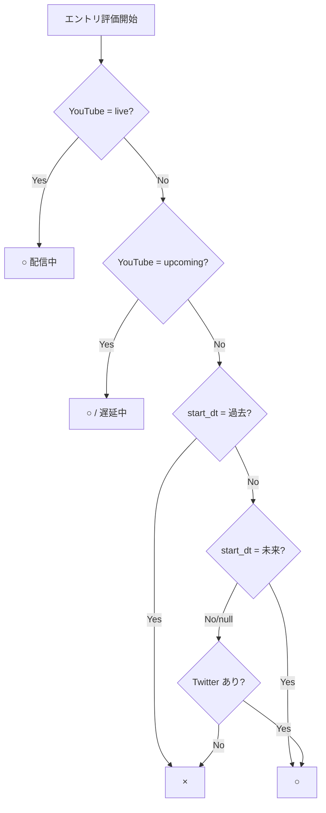
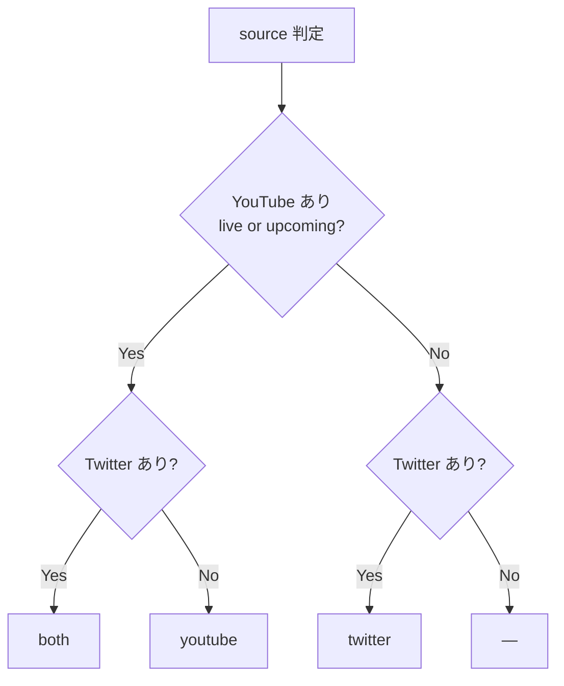

# vt-scheduler

VTuberの配信予定を自動収集してダッシュボードに表示するシステム。

https://f2sk.github.io/vt-scheduler/

## 監視対象

- 音乃瀬奏 (@otonosekanade)
- 桃鈴ねね (@momosuzunene)
- しぐれうい (@ui_shig)

## アーキテクチャ

```
Raspberry Pi (ローカル)               GitHub
────────────────────────────────────  ──────────────────────────────────────
【毎時:20/:50】                        Actions: update.yml (10分ごと)
scrape_twitter.py                       ├─ generate_html.py → GitHub Pages
  └─ Playwright + cookies               └─ update_calendar.py → Google Calendar
  └─ tweet_store.json に蓄積
  └─ actions/twitter.json 生成

【毎時:07/:17/:27/:37/:47/:57】
fetch_youtube.py
  └─ YouTube Data API (OAuth2)
  └─ メン限を含む live/upcoming を取得
  └─ youtube.json 生成
analyze.py
  └─ Cerebras API (qwen-3-235b)
  └─ twitter.json + youtube.json
       → schedule.json (streams配列)
       ※ LLM失敗時は youtube のみでフォールバック
push_to_github.py
  └─ twitter.json / youtube.json /
     schedule.json を data ブランチへ
     force push
backup.py
  └─ cookies.json / youtube_token.json /
     tweet_store.json を AES-256 暗号化して
     main ブランチにコミット（差分のみ）
```

TwitterスクレイピングはBANリスク管理のため30分おき。YouTube取得・LLM解析・pushは10分おきで独立実行。ページ生成・カレンダー登録・デプロイはGitHub Actionsで完結。

## ファイル構成

| ファイル | 実行場所 | 概要 |
|---|---|---|
| `scrape_twitter.py` | Raspberry Pi | Playwright でツイートを取得し `tweet_store.json` に蓄積、`actions/twitter.json` を生成（毎時:20/:50） |
| `youtube_analyze_push.py` | Raspberry Pi | YouTube取得→LLM解析→push→バックアップを実行（毎時:07/:17...） |
| `actions/fetch_youtube.py` | Raspberry Pi | YouTube Data API (OAuth2) で live/upcoming 動画を取得し `youtube.json` を生成（UUMOプレイリストでメン限も取得） |
| `actions/analyze.py` | Raspberry Pi | Cerebras API (Qwen3-235B) で全配信を `streams` 配列として構造化。前回の `schedule.json` から配信を引き継ぎマージ（表示ロジックは下記参照）。LLM失敗時はYouTubeのみでフォールバック |
| `push_to_github.py` | Raspberry Pi | `twitter.json` / `youtube.json` / `schedule.json` を `data` ブランチへ履歴なしで force push |
| `backup.py` | Raspberry Pi | 認証情報ファイルを AES-256-CBC で暗号化して main ブランチにバックアップ |
| `restore.py` | Raspberry Pi / PC | バックアップから認証情報ファイルを復元 |
| `actions/generate_html.py` | GitHub Actions | `schedule.json` + `twitter.json` + `youtube.json` から `index.html` を生成 |
| `actions/update_calendar.py` | GitHub Actions | `schedule.json` の配信を Google Calendar に登録・更新（削除はしない、累積管理） |

## データフロー

1. ラズパイが毎時:20/:50 に `scrape_twitter.py` を起動（Twitterスクレイピング）
   - 最大3分のランダム遅延あり（BANリスク軽減）
2. ラズパイが毎時:07/:17/:27/:37/:47/:57 に `youtube_analyze_push.py` を起動
   - fetch_youtube.py → analyze.py（Cerebras）→ push_to_github.py → backup.py
   - pushされた直近のtwitter.jsonをLLMが参照してマージ
   - analyze.py は前回の schedule.json から配信を引き継ぎ（表示ロジックは下記参照）
3. GitHub Actions が10分ごとに data ブランチから3ファイルを取得
4. `index.html` を生成して GitHub Pages へデプロイ
5. Google Calendar に配信予定を登録（同一配信は `screen_name + start_datetime` から生成したIDで冪等管理）

## schedule.json スキーマ

```json
{
  "analyzed_at": "2026-05-08T16:35:00+00:00",
  "schedule": {
    "otonosekanade": {
      "streams": [
        {
          "start_datetime": "05/08 21:00",
          "title": "配信タイトル",
          "stream_type": "solo",
          "collab_note": null,
          "source": "youtube",
          "stream_url": "https://www.youtube.com/watch?v=..."
        }
      ]
    }
  }
}
```

## schedule.json 表示ロジック

`analyze.py` の `merge_with_previous` が、LLM 新規結果と前回 `schedule.json` のエントリをマージする際に以下の判定を行う。

### 条件組み合わせ表

| # | Twitter | YouTube status | start_dt | 表示 | source |
|---|---|---|---|---|---|
| 1 | あり | upcoming | 未来 | ○ | both |
| 2 | あり | upcoming | 過去 | ○（遅延中） | both |
| 3 | あり | upcoming | null | ○ | both |
| 4 | あり | live | 未来 | ○（配信中） | both |
| 5 | あり | live | 過去 | ○（配信中） | both |
| 6 | あり | live | null | ○（配信中） | both |
| 7 | あり | none | 未来 | ○ | twitter |
| 8 | あり | none | 過去 | × | — |
| 9 | あり | none | null | ○ | twitter |
| 10 | なし | upcoming | 未来 | ○ | youtube |
| 11 | なし | upcoming | 過去 | ○（遅延中） | youtube |
| 12 | なし | upcoming | null | ○ | youtube |
| 13 | なし | live | 未来 | ○（配信中） | youtube |
| 14 | なし | live | 過去 | ○（配信中） | youtube |
| 15 | なし | live | null | ○（配信中） | youtube |
| 16 | なし | none | 未来 | ○（carry-forward） | — |
| 17 | なし | none | 過去 | × | — |
| 18 | なし | none | null | × | — |

- **Twitter あり**: そのエントリの `source` フィールドが `twitter` または `both`
- **YouTube status**: 現在の `youtube.json` における当該 URL のステータス（`live` / `upcoming` / なし）
- **#16**: Twitter もなく YouTube も未確認だが `start_dt` が未来 → carry-forward で保持（例：枠が立つ前の告知ツイートが取得範囲外に出た状態）

### 表示判定フロー



### source 判定フロー



## セットアップ

### GitHub Secrets

| シークレット名 | 内容 |
|---|---|
| `GOOGLE_CREDENTIALS_JSON` | Google サービスアカウントの JSON キー（文字列） |
| `GOOGLE_CALENDAR_ID` | 登録先 Google Calendar の ID |

### Raspberry Pi

```bash
# 依存インストール
python3 -m venv .venv
source .venv/bin/activate
pip install playwright playwright-stealth google-auth google-auth-oauthlib requests
playwright install chromium

# .env に以下を設定
# GITHUB_TOKEN=...
# CEREBRAS_API_KEY=...
# BACKUP_PASSPHRASE=...  ← D:\dev\claude\web\vt-scheduler\.env を参照

# 認証情報ファイルをバックアップから復元
BACKUP_PASSPHRASE=... python3 restore.py
# 復元されるファイル:
#   cookies.json        — Twitter認証クッキー
#   youtube_token.json  — YouTube OAuth2トークン
#   tweet_store.json    — Twitterツイート蓄積データ

# cron 設定
# 20,50 * * * * cd ~/vt-scheduler && set -a && . ./.env && set +a && .venv/bin/python scrape_twitter.py >> cron.log 2>&1
# 7,17,27,37,47,57 * * * * cd ~/vt-scheduler && set -a && . ./.env && set +a && .venv/bin/python youtube_analyze_push.py >> cron.log 2>&1
```

### YouTube OAuth 初回セットアップ

YouTube のメンバー限定配信を取得するために、ユーザーアカウントの OAuth 認証が必要。バックアップから復元できる場合は不要。

1. Google Cloud Console で OAuth 2.0 クライアント ID を作成（デスクトップアプリ）
2. OAuth 同意画面でテストユーザーに自分のアカウントを追加
3. `client_secret.json` を `C:\tmp\` に配置して以下を実行：
   ```powershell
   pip install google-auth-oauthlib
   python C:\tmp\auth_youtube.py
   ```
4. 生成された `youtube_token.json` を Pi に転送：
   ```powershell
   scp C:\tmp\youtube_token.json <pi>:~/vt-scheduler/youtube_token.json
   ```

### GitHub Pages

`Settings` → `Pages` → `Source: GitHub Actions`

### Google Calendar

1. Google Cloud Console でサービスアカウントを作成し、JSON キーを発行
2. カレンダーの共有設定でサービスアカウントに「予定の変更」権限を付与
3. カレンダー ID と JSON キーを GitHub Secrets に登録

## 手動実行

```bash
# Twitter スクレイピング
ssh <pi> 'cd ~/vt-scheduler && set -a && . ./.env && set +a && .venv/bin/python scrape_twitter.py'

# YouTube取得・解析・push
ssh <pi> 'cd ~/vt-scheduler && set -a && . ./.env && set +a && .venv/bin/python youtube_analyze_push.py'

# Actions 手動トリガー
gh workflow run update.yml --repo <owner>/vt-scheduler
gh run watch --repo <owner>/vt-scheduler
```
