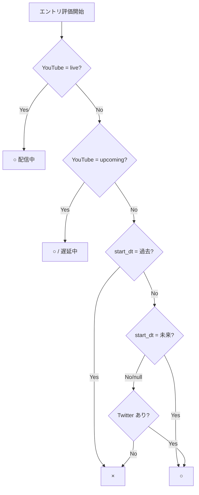
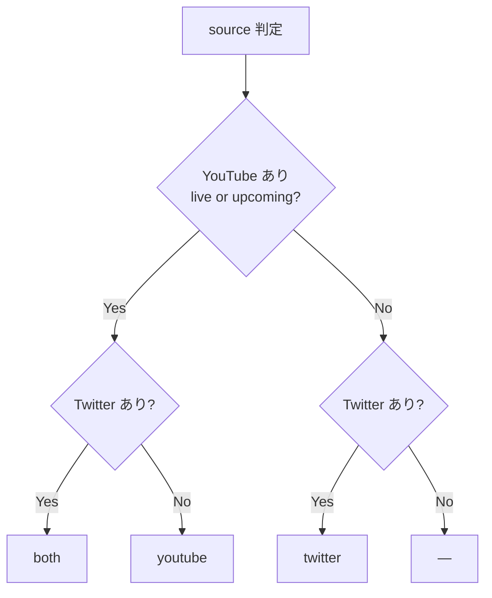

# vt-scheduler

VTuberの配信予定を自動収集してダッシュボードに表示するシステム。

https://vt-scheduler.pages.dev/

## 監視対象

- 音乃瀬奏 (@otonosekanade)
- 桃鈴ねね (@momosuzunene)
- しぐれうい (@ui_shig)

## アーキテクチャ

```
Raspberry Pi（自宅）          GitHub                  Cloudflare
─────────────────────         ──────────────────────  ──────────────────
【毎時:20/:50】               dataブランチ push時       Pages
full_pipeline.py              Actions: update.yml       └─ index.html 配信
  └─ Twitter取得                ├─ generate_html.py          (Access認証)
  └─ YouTube取得                └─ update_calendar.py
  └─ analyze.py（LLM）              → Google Calendar
  └─ dataブランチpush

【毎時:00/:10/:30/:40】
youtube_analyze_push.py
  └─ YouTube取得
  └─ analyze.py（LLM）
  └─ dataブランチpush
```

## ファイル構成

| ファイル | 実行場所 | 概要 |
|---|---|---|
| `actions/fetch_youtube.py` | Raspberry Pi | YouTube Data API (OAuth2) で live/upcoming 動画を取得し `youtube.json` を生成（メン限含む） |
| `actions/analyze.py` | Raspberry Pi | Cerebras API (Qwen3-235B) で配信情報を `streams` 配列として構造化。前回の `schedule.json` からエントリをマージ。LLM失敗時はYouTubeのみでフォールバック |
| `actions/generate_html.py` | GitHub Actions | `schedule.json` から `index.html` を生成 |
| `actions/update_calendar.py` | GitHub Actions | `schedule.json` の配信を Google Calendar に登録・更新 |

## schedule.json スキーマ

```json
{
  "analyzed_at": "2026-05-08T16:35:00+00:00",
  "schedule": {
    "otonosekanade": {
      "streams": [
        {
          "start_datetime": "05/08 21:00",
          "title": "配信タイトル",
          "stream_type": "solo",
          "source": "youtube",
          "stream_url": "https://www.youtube.com/watch?v=..."
        }
      ]
    }
  }
}
```

## schedule.json 表示ロジック

### 条件組み合わせ表

| # | Twitter | YouTube status | start_dt | 表示 | source |
|---|---|---|---|---|---|
| 1 | あり | upcoming | 未来 | ○ | both |
| 2 | あり | upcoming | 過去 | ○（遅延中） | both |
| 3 | あり | upcoming | null | ○ | both |
| 4 | あり | live | 未来 | ○（配信中） | both |
| 5 | あり | live | 過去 | ○（配信中） | both |
| 6 | あり | live | null | ○（配信中） | both |
| 7 | あり | none | 未来 | ○ | twitter |
| 8 | あり | none | 過去 | × | — |
| 9 | あり | none | null | ○ | twitter |
| 10 | なし | upcoming | 未来 | ○ | youtube |
| 11 | なし | upcoming | 過去 | ○（遅延中） | youtube |
| 12 | なし | upcoming | null | ○ | youtube |
| 13 | なし | live | 未来 | ○（配信中） | youtube |
| 14 | なし | live | 過去 | ○（配信中） | youtube |
| 15 | なし | live | null | ○（配信中） | youtube |
| 16 | なし | none | 未来 | ○（carry-forward） | — |
| 17 | なし | none | 過去 | × | — |
| 18 | なし | none | null | × | — |

### 表示判定フロー



### source 判定フロー



## GitHub Secrets

| シークレット名 | 内容 |
|---|---|
| `CLOUDFLARE_API_TOKEN` | Cloudflare Pages デプロイ用APIトークン |
| `CLOUDFLARE_ACCOUNT_ID` | CloudflareアカウントID |
| `GOOGLE_CREDENTIALS_JSON` | Google サービスアカウントの JSON キー |
| `GOOGLE_CALENDAR_ID` | 登録先 Google Calendar の ID |
